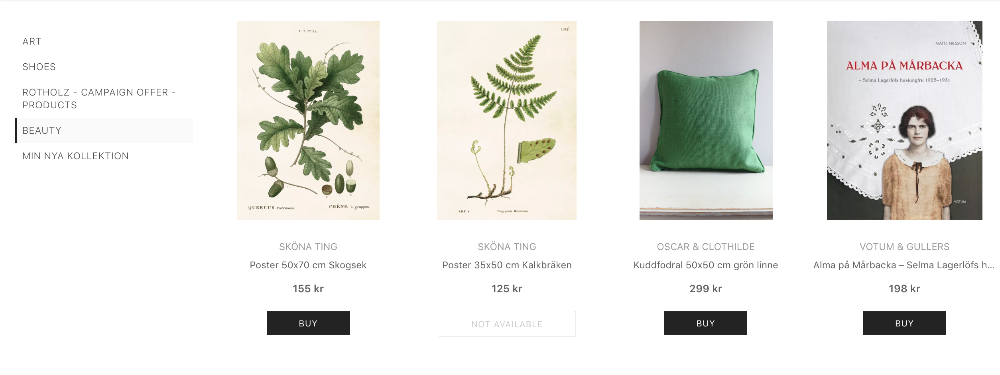

#Tipser Elements

Tipser Elements is a set of shoppable elements built on top of Tipser <a href="https://developers.tipser.com/rest-api" target="_blank">REST API</a> and Tipser [SDK](#tipser-sdk):

* **Product** - product display with variant selector and add to cart button
* **Collection** - a group of products
* **Store** - shop with collections, products and menu navigation
* **Cart** - cart icon with an easy access to the cart and checkout


***


## Quick start
This quick guide explains how to intialize and render Tipser Elements on your page. It requires you to have a publisher account created in order to get the `posId`, as well as have some collections created in your shop <a href="https://app.tipser.com/" target="_blank">here</a>.

If you're all set up, follow these three steps to install Tipser Elements on your site!

***

### Installation of Tipser Elements

To use Tipser Elements on your site, add the following script to your page. This is an entry point to Tipser Elements that exposes a global `tipser` object, that you will use later to initialize Elements and customize its behavior.

```html
<script src="https://cdn.tipser.com/tipser-script/latest.js"></script>
```
<aside class="notice">
Make sure, that Tipser Elements script is <strong>loaded only once on your page</strong>. Additionally, it is recommended to load the scripts at the end of the <code>body</code> element on your page so that the rendering is not blocked by JavaScript parsing. 
</aside>

***

### Inserting Tipser Element
Insert this HTML snippet on your page in the place where you want the `Store` element to be rendered. Typically, this will be a new blank subpage created in your CMS, as the `Store` is best displayed in the full page mode.

```html
<div id="tipser_store"></div>
```

<aside class="notice">Tipser Elements works by scanning your HTML and replacing special tags with shoppable elements - even if these special tags are added dynamically, thanks to the usage of <a target="_blank" href="https://developer.mozilla.org/en-US/docs/Web/API/MutationObserver">MutationObserver API</a>.</aside>
***

## Initializing Tipser Elements

Initializing Tipser Elements is a line of JavaScript code.

```js
tipser.elements('posId')
```

Make sure that the `posId` is replaced with the actual id corresponding to your account.

If you need to pass custom settings (see: [configuration](#configuration-options)), you can pass an `options` object as second argument.

```js
tipser.elements('posId', options)
```

Complete working example could look like:

```html
<!DOCTYPE html>
<html>
  <body>
    <div id="tipser_store"></div>
    <script src="https://cdn.tipser.com/tipser-script/latest.js"></script>
    <script>
      tipser.elements('posId')
    </script>
  </body>
</html>
```


If everything was setup correctly, you should see the `Store` element populated with all your collections in place of `<div id="tipser_store">`. 

[](/images/tipser_elements_store.png)

> <a href="https://codepen.io/tipser-tech/pen/YMMKMp" target="_blank">Open this snippet on Code Pen</a>


<aside class="success">Congratulations! You have successfully integrated and setup Tipser Elements on your site.</aside>

***

## Configuration

Main Tipser Elements function has two arguments.

```ts
tipser.elements(posId: string, config?: TipserElementsConfig)
```
- `posId` - **required** - unique POS identifier. Must be specified in order to show your personalized store, handle campaigns and commissions. If you are not sure where to get it from, contact your account manager. 
- `config` - allows you to specify how Tipser Elements will look and behave on your site. See the [customization](#configuration-options) section that describes most common configuration options you need to know, while the complete index of all the supported configuration options can be found further in the <a href="https://developers.tipser.com/rest-api" target="_blank">API reference</a>.

***


## `Store` Element

The Store is the best way to present a group of collections on a separate page. It is best to place it on a page where sufficient space is available, however, the script automatically blends in and adapts to the given space.

Collections are created using the <a href="https://app.tipser.com/" target="_blank">app.tipser.com</a> (when logged in to a publisher account).

Before you insert Store on your page, make sure there is at least one collection created in your store, otherwise no content will be rendered.

Insert the following HTML snippet in your code in the place where you want the `Store` element to be rendered.

```html
<div id="tipser_store"></div>
```

For more fitting mobile experience you can choose between two types of mobile menu. The default one is a dropdown with categories. 
The optional menu renders inline menu items, and is applied by adding `data-tipser-inlineMenu` attribute to the HTML snippet:

```html
<div id="tipser_store" data-tipser-inlineMenu></div>
```

<aside class="notify"><code>Store</code> Element is best inserted as a top-level Element on a separate page and should take the full content area for the best shopping experience.</aside>

*** 

## `Product` Element
In order to insert a `Product` Element in your content, insert the following code snippet in your content:

```html
<div data-tipser-pid="5ba2334a781baa0001ccdf61" />
```

Elements with attribute `data-tipser-pid` will be replaced with `Product` Element. Product ID is taken from the value of the attribute. The code snippet for a certain product can be generated in <a href="https://app.tipser.com/" target="_blank">app.tipser.com</a>. 
By default, a full inline product component is displayed (with product details and variant selection).


[](/images/full-product.png)

***

To display `Product` in a compact view, add the `data-tipser-view="compact"` attribute to above tag.

```html
<div data-tipser-pid="57233dac89862012f8ec1001" data-tipser-view="compact" />
```

[](/images/compact-product.png)


To display a list of products (rendered as small product tiles), add `data-tipser-pids` attribute to the snippet together with the `productId`s of the products you would like to display.

```html
<div data-tipser-pids="5a8ac10d9d2580326ca4cf47,5a9735d99d25801620c3d3fc,5a8af4909d2580132ca4c1f9" />
```


[](/images/product-list.png)

<aside class="success">All Elements are mobile first. This means that even if you insert a regular `Product` Element, it will be rendered like a compact product on the mobile devices for better experience.</aside>

***


## `Collection` Element
 
`Collection` is a group of simple product tiles. Clicking on any title displays a product dialog with more product details and add to cart button. Products displayed in a collection are defined in <a href="https://app.tipser.com/" target="_blank">app.tipser.com</a>.

```html
<p name="My collection" data-tipser-cid="5b2788909d25801adcb23f4f" />
<p name="My collection" data-tipser-cid="5b2788909d25801adcb23f4f" data-tipser-imgsize="small" />
<p name="My collection" data-tipser-cid="5b2788909d25801adcb23f4f" data-tipser-carousel />

```

Elements with attribute `data-tipser-cid` will be replaced with `Collection` element of given id (value of `data-tipser-cid`). 

[](/images/collection.png)

To make the collection items smaller / larger use the `data-tipser-imgsize` attribute with values `small` for smaller  and `large` for lager product tiles. The default value for imgSize parameter is `medium`. When changing the value to `small` you get slightly smaller product-cards:

[](/images/collection-imgSize.png)

If you'd like the collection of more than several products to take less space, you can display it as one-row only carousel element. To do that, please use `data-tipser-carousel` attribute.

[](/images/colltion-carousel.png)


> <a href="https://codepen.io/tipser-tech/pen/YMMKMp" target="_blank">Open this snippet on Code Pen</a>

***

## `Cart` Element

To keep the user informed about the state of their shopping cart and make it possible to finalize the checkout process at any time, you can attach a live shopping cart icon on your page.

```js
tipser.elements('posId')
      .mountCart('.my-cart-container');
```

To activate the Cart, you need to dedicate an element on your page to host a shopping cart and pass a CSS selector to that element to the `mountCart` function, as in the example snippet.

The cart icon can be placed anywhere on your website. If you want to keep it visible at all times, please follow the [instructions](#cart).


## Versioning
  
Tipser Elements follows <a href="https://semver.org/" target="_blank">Semantic Versioning</a>. This means that an increase in the major number in our version indicates potential <b>breaking changes</b>. Please be aware of that! For the react version, it is recommended to auto-update to the latest version with the same major number (see the caret (^) character in `package.json` file described <a href="https://stackoverflow.com/a/22345808" target="_blank">here</a>). 

<aside class="warning">Be aware, that tipser-elements (non-react) is always updating to the newest version published, even if the increased major version is introduced.</aside>


## API reference

All configuration supported by Tipser Elements is listed below.

Parameter | Default | Description | Example
--------- | ------- | ----------- | -------
lang | `'en-US'` | a locale to be used by the Tipser content. Possible values: `'en-US'`, `'de-DE'`, `'fr-FR'` and `'sv-SE'`. More info at [Language and locale](#language-and-locale)[Environment](#environment)| `'de-DE'` 
env | `'prod'` | Tipser environment to be used by the Tipser content. Possible values: `'stage'` and `'prod'`. More info at [Environment](#environment)| `'stage'`
defaultAddedToCartPopup | `true` | Controls default Added To Cart Popup. It appears when user adds a product to the cart. It improves UX by highlighting the action and allowing to navigate quickly to the cart modal window.  | `true` or `false` 
useDefaultErrorHandler | `true` | when set to false and error happens, default message won't be displayed | see [Adding onError handler](#onerror)
eventsHandlers | `{}` | the object of event handlers. See [Event handlers](#event-handlers)  | `object` | { onError: console.error.bind(console) }  
useDeepLinking | `true` | Makes Shop element to use hash navigation when switching between categories. More info at [Use Deep Linking](#use-deep-linking):  | `false`
modalUi | `{}` | Customization of Tipser Dialog. More info at [Parameters for dialog customization](#parameters-for-dialog-customization)| `{ hideSearchIcon : true}` 
primaryColor | #333 | Hex color code, affecting eg. buy-button color and Cart indicator | #5F9F9F
disableDialog | false | If set to `true`, a redirect to the product page is done instead of opening the product dialog (read more at: [Embedding Elements in native apps](#embedding-elements-in-native-apps) section) | `false`


***

### Event handlers

Event handlers can be passed as part of configuration. There is a number of event exposed by the Tipser Elements that can be listened to programatically, such as technical events, shopping behavior, errors and analytics. You may hook in your event listener into Tipser Elements via `eventsHandlers` option.

```js
 tipser.elements('posId', { 
    eventsHandlers: {
      onAddToCart: payload => {
          console.log('Hurray, you have added item to cart. ', payload.product);
          console.log('Your cart size is now. ', payload.cartSize);
      }
    }
  })
```

Whenever an event occurs, Tipser Elements will call your event listener, passing only one argument - `payload` - which will hold event data (different to each event type). Above example demonstrates how to listen to the add to cart event and log current cart size and newly added product. Currently supported handlers are:  `onAddToCart` and `onError`.

***

#### onAddToCart

```
onAddToCart: (cartSize: number, product: TipserProductModel)
``` 

- `cartSize`- property contains the cart size **after a product has been added to the cart** 
- `product` - is an object as well and representing the product which has been added to cart. The model of the `product` field is as follows.
  
`TipserProductModel` interface is as follows:

```ts
interface TipserProductModel {
    id: string;
    title: string;
    description: string;
    brand: string;
    images: any[];
    isInStock: boolean;
    deliveryTime: string;
    priceIncVat: PriceModel;
    deliveryCost: PriceModel;
    variants: TipserProductModel[];
    discountPriceIncVat: PriceModel;
    freeReturn: boolean;
}
```

***

#### onError

By default, in case of an unexpected error happening (connection issues or unhandled runtime exceptions), an error popup will appear. If you want to disable the deafult error messages, set `useDefaultErrorHandler` option to `false`, and listen to error messages via `onError` event handler.

```js
 tipser.elements('posId', { 
    useDefaultErrorHandler: true, 
    eventsHandlers: {
      onError: error => {
          console.log(error);
      }
    }
  })
```

The payload of `error` event is as follows:

- `type`: `TipserElementError` object 

- `id`: string

- `message`: error message

- `stack`: typical error stack of js error

The `onError` event handler is used with `useDefaultErrorHandler` config option. When that option is set to false (default to true) the error will not be shown on the screen.

<aside class="warning">This section requires simplification. It isn't clear how to use event handler with combination of this configuration</aside>

#### onStockCountChange

This handler takes care of the edge case, when while in the checkout process and before payment, the stock count of an item in the cart becomes lower than the number of items in the cart. By default, in such a situation, we display an overlay with an information about the stock count change and the button for reloading the checkout. If you wish to customize this behaviour, you can use a callback `onStockCountChange(items: CartItemModel[]) => void`, which will prevent the default behavior.

## Customizing Tipser Elements Styles ##

Tipser Elements are the "building blocks" designed to fit your page as much as possible. We created the styling in a way that delivers a nice look & feel from the start, but also allows you to change them easily to fit your unique sense of style. For example, all elements' `font-family` and `font-size` attributes are set to inherit them from the host page. If you need to change some other styles, please overwrite the CSS classes corresponding to the elements that you customize (listed below).

### Product Card ###

The Product Card is an item used for displaying a single tile in a `Collection` or `Store` component, among others. The font-family used in the description section of the Product Card is inherited from your website's styles, and the font-size is expressed in the relative `em` units controlled in `.te-product-card` class. The default value used there is `12px`, which you can easily change by adding to your CSS the following style:
   
   ```css
   .te-product-card {
       font-size: 14px;
   }
   ```
   
   All the description elements (product name, brand and price) will become bigger / smaller according to the value you specify in the `px` unit. If you wish to change single description element, please use its specific class names: 
   
   `.te-product-card-name` <br/>
   `.te-product-card-brand`<br/>
   `.te-product-card-price`<br/>
   and:<br/>
   `.te-product-card-sales-price`<br/>
   `.te-product-card-price-regular-price`<br/>
   for products on sale.
   

### Cart ###

The Cart component with the cart icon can be placed anywhere on your website. (It is highly advisable to place it in your navigation element among other icons such as search, home etc.) However, if you want to keep it visible at all times, attached to the right side of the viewport, you can use these styles:

```css
.cart-icon {
    position: fixed;
    right: 0;
    top: 121px;
    background: #fff;
    padding: 10px;
    box-shadow: -2px 2px 7px rgba(0,0,0,0.3);
    z-index: 10;
}
```

### Adding Primary color ###

If you'd like to unify our design with your own color-theme, you can use our primary-color [configuration option](#primary-color). If your primary color is a bright one, you might also want to change the text color of the elements that use the primary color as the background, e.g. add to cart buttons. For example in buttons by default the color we use is white.

```css

/* if your primary color is bright,
    you may also consider changing the text color for elements like buttons: */
.te-button-text {
    color: #333;
}
```
If you'd like to change other elements' color as well, please use specific classes to override the styles.


## Starter projects

A working examples of page based on Tipser Widget can be found on <a href="https://tipser.github.io/tipser-widget-bootstrap/" target="_blank">Tipser Widget Bootstrap page</a>.

The code of that page is available as a GitHub <a href="https://github.com/Tipser/tipser-widget-bootstrap" target="_blank">Tipser Widget Bootstrap project</a>. Feel free to checkout it and play with it on your local machine!

